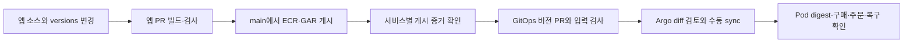

# CI에서 CD로 릴리스 인계

CI가 게시한 버전과 CD가 요청한 버전, 실제 Pod의 이미지가 이어져야 한다. 현재 방식은 앱 저장소에서 서비스 버전을 올려 이미지를 게시하고, 게시 결과를 확인한 뒤 GitOps PR로 원하는 버전을 갱신하는 흐름이다. 이 준비에서는 자동 GitOps 쓰기나 Image Updater를 추가하지 않았다.

## 인계 기록

각 릴리스 PR에 아래 내용을 채운다. 변경하지 않은 서비스는 새로 게시했다고 표시하지 말고 직전 증거를 참조한다. 다섯 서비스가 항상 같은 소스 SHA에서 게시되는 것은 아니다.

| 항목 | 기록할 내용 |
|---|---|
| 서비스와 이미지 버전 | 변경 서비스별 vMAJOR.MINOR.PATCH |
| 소스 | 그 이미지를 빌드한 앱 commit SHA |
| CI 게시 증거 | Actions run URL과 해당 서비스 publish job의 성공 결과 |
| ECR | 전체 repository, tag, 게시된 manifest digest |
| GAR | 전체 repository, tag, 게시된 manifest digest |
| 동일성 | 해당 버전의 ECR/GAR manifest digest가 같은지 |
| 검증 | 빌드·기동·통합 시험 결과와 미검증 사항 |
| 배포 의존성 | Secret 참조, endpoint, 계측·DB 호환성 변화 |
| 복구 기준 | 이전 정상 GitOps commit과 서비스 버전, 되돌릴 수 없는 변경 여부 |

로컬 Docker image ID와 registry manifest digest는 서로 다른 값이므로 바꿔 적지 않는다. CI 전체가 초록색이어도 publish job이 skipped라면 새 게시의 증거가 아니다. 9월 9일 [run 34316790711](https://github.com/AWSome-BIT-Bespin/retail-store-app/actions/runs/34316790711)은 차트만 바뀌어 게시를 건너뛴 사례다.

Cart v0.0.2, Orders v0.1.1, UI v0.1.6의 기존 게시 증거는 [run 34305372158](https://github.com/AWSome-BIT-Bespin/retail-store-app/actions/runs/34305372158), 앱 소스 `0c89f755de72bc699629300c17fb307bda87c200`이다. 새 Catalog v0.0.3과 Checkout v0.0.4는 앱 소스 `14b3fb3726f20780b7591155bae9154d90394899`와 [run 35067357831](https://github.com/AWSome-BIT-Bespin/retail-store-app/actions/runs/35067357831)에서 양쪽 registry 게시 및 digest 검증 단계가 성공했다. 9월 16일 ECR API에서도 아래 다섯 버전의 존재를 확인했다.

| 서비스 | 정식 버전 | ECR manifest digest |
|---|---|---|
| Cart | v0.0.2 | sha256:d0b2f8e4ec97d5165851af43299691a70894a0668b244735abc631e512f2c0fc |
| Catalog | v0.0.3 | sha256:3de6e79eb9463e625cbca8b1d41cb438fee6f9dd0f23136c12a8ad174cdd384c |
| Checkout | v0.0.4 | sha256:b9e8321595338baee1971d1fc6da11f56c57f3d9d41d56e042cd3f0b599be045 |
| Orders | v0.1.1 | sha256:cb2fe8ff5939976f0b22a58b06fa47ffb656a0740fdb41d25ec79633874f7c9b |
| UI | v0.1.6 | sha256:481feb626f209522c5b31b73738916337ab9e5bf425c146bff249ff9049ea06e |

## 버전 변경 절차

1. 앱 담당이 기동 조건과 호환성을 확인한다. 새 Catalog 이미지의 WhaTap 불일치가 남아 있으면 새 버전 배포를 진행하지 않는다.
2. CI 담당이 앱 PR을 검토·병합하고 실제 게시 job을 확인한다. ECR/GAR에 한쪽만 존재하거나 digest가 다르면 CD로 넘기지 않고 게시 상태를 먼저 해결한다. 같은 버전 태그를 덮어쓰는 방식으로 해결하지 않는다.
3. CD 담당이 위 인계 기록을 검토한 뒤 `src/app/chart/versions.yaml`의 해당 서비스 태그만 변경한다. 환경별 파일에 태그를 복제하지 않는다.
4. GitOps PR에서 구조 검사, 해당 환경의 배포 입력 검사와 Helm 렌더링 결과를 확인한다. actual 환경 파일이 아직 없다면 구조 CI만으로 배포를 승인하지 않는다.
5. 검토한 commit이 Application의 targetRevision에 포함된 것을 확인하고 [배포 절차](deploy-and-rollback.md)를 따른다. 버전을 저장소에 적었다는 사실과 실제 Argo sync 성공을 각각 기록한다.

이번 GitOps 변경은 Catalog를 v0.0.3, Checkout을 v0.0.4로 올리며 Cart v0.0.2, Orders v0.1.1, UI v0.1.6을 유지한다. 다만 실제 기존 Pod는 이 기록보다 오래된 Cart v0.0.1, Catalog v0.0.1, Checkout v0.0.1, Orders v0.1.0, UI v0.1.2였다. 현재 버전으로 최초 Argo 인수를 확인한 다음 릴리스 동기화에서 다섯 서비스를 정식 버전으로 맞추므로 전체 서비스 검증이 필요하다. 과거 로컬 UI v0.1.7 후보는 이번 릴리스에 포함하지 않는다.

두 환경은 같은 `versions.yaml`을 참조한다. 이 기록을 변경하면 AWS/GCP 모두 다음 sync의 원하는 버전이 바뀐다. 현재 초안은 수동 sync이므로 실제 동기화 시점은 따로 정할 수 있지만, 환경마다 서로 다른 버전을 장기간 유지하거나 독립적으로 rollback할 필요가 생기면 버전 기록 분리 정책부터 검토한다.
